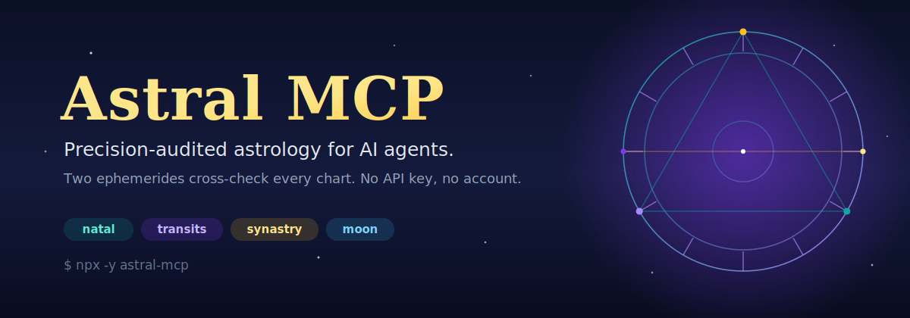

<!-- astral-mcp header v1 -->
<h1 align="center">Astral MCP</h1>

<div align="center">
  
</div>

<h3 align="center">
  Give your AI agent real astrology &mdash; natal charts, transits, synastry &amp; moon phases.<br>
  Computed locally, <strong>cross-checked by two independent ephemerides</strong>. No API key, no account.
</h3>

<p align="center">
  <a href="https://www.npmjs.com/package/astral-mcp"></a>
  <a href="https://www.npmjs.com/package/astral-mcp"></a>
  <a href="LICENSE"></a>
  <a href="https://modelcontextprotocol.io"></a>
</p>

<p align="center">
  <a href="https://github.com/davidmosiah/astral-mcp/stargazers"></a>
  <a href="#precision"></a>
  <a href="#setup-in-60-seconds"></a>
</p>

> ⚡ **Zero-setup install.** Wire it into Claude Desktop / Cursor / Hermes and call it immediately &mdash; no API key, no OAuth, no account:
> `npx -y astral-mcp`

**A local-first MCP server that turns birth data into a full, precision-audited astrological reading for AI agents.** Stateless and computational — nothing is stored, no credentials exist, and every tool but optional geocoding runs fully offline.

Built by [David Mosiah](https://github.com/davidmosiah). The astrology engine is ported from the [Alkhemia](https://alkhemia.app) app.

## Why this exists

Most astrology libraries are fragile single-engine wrappers, and most "astrology APIs" want a key and a subscription. Agents need something they can trust and call instantly. Astral MCP does two things differently:

1. **It just works.** `npx -y astral-mcp` and you're calling charts — no OAuth, no account, no birthplace database to install.
2. **It checks itself.** Every natal chart is computed with one ephemeris and then independently re-derived, planet by planet, with a second one. If they disagree beyond a tight tolerance, the chart is flagged `review` instead of silently returning a wrong placement.

## Setup in 60 seconds

Add it to your MCP client (Claude Desktop, Cursor, Hermes, …):

```json
{
  "mcpServers": {
    "astral": {
      "command": "npx",
      "args": ["-y", "astral-mcp"]
    }
  }
}
```

That's the whole setup. There is nothing to authenticate.

Run it directly if you want:

```bash
npx -y astral-mcp                      # stdio (default)
ASTRAL_MCP_TRANSPORT=http npx -y astral-mcp   # streamable HTTP on 127.0.0.1:3000
```

## See it before you connect

Call **`astral_demo`** for a fully-worked example chart (Greenwich, noon, Y2K) including its precision audit — no input, no network, no auth. It shows you the exact payload shape before you send real birth data.

## Try it with your agent

> "What's my natal chart? I was born 23 Feb 1989, 14:30, in Fortaleza, Brazil."

The agent calls `astral_search_birthplace` to resolve Fortaleza → lat/lon/timezone, then `astral_compute_natal_chart`.

> "Any big transits hitting my chart this week?"  → `astral_current_transits`
> "How compatible are we?" (two birth datas)     → `astral_synastry`
> "What phase is the moon in today?"              → `astral_moon_phase`

## Precision

Astral MCP ships every natal chart with a precision audit. The primary engine ([circular-natal-horoscope-js](https://www.npmjs.com/package/circular-natal-horoscope-js)) computes the chart; the verifier ([astronomy-engine](https://www.npmjs.com/package/astronomy-engine)) re-derives each planet's ecliptic longitude independently. A chart is `verified` only when every planet agrees within tolerance and lands in the same sign.

Across a built-in accuracy suite of charts spanning 1945–2010 and six timezones, the **worst cross-engine disagreement is under 0.01°**. Run it yourself:

```bash
npm run test:accuracy
```

## Data availability

| Capability | Supported |
|---|---|
| Planets (Sun…Pluto), Ascendant, MC/IC | ✅ |
| Houses (placidus, koch, campanus, regiomontanus, topocentric, equal-house, whole-sign) | ✅ |
| Major aspects with orb, strength, applying/separating | ✅ |
| Chart signature (dominant element/modality, pattern, stelliums, angular planets) | ✅ |
| Retrogrades · timezone/DST handling | ✅ |
| Transits (current + upcoming) · moon phase | ✅ |
| Synastry (two-chart comparison, scored) | ✅ |
| Tropical & sidereal zodiac | ✅ |
| Lunar nodes, Chiron, asteroids, fixed stars | ⏳ planned |
| Minor aspects | ⏳ planned |
| Interpretation text | ❌ by design — astral-mcp returns structured data; your model writes the reading |

## Tools

- `astral_compute_natal_chart` — full natal chart, precision-audited by default
- `astral_current_transits` — current + upcoming transits to a chart, with moon phase
- `astral_synastry` — compare two charts (harmony / chemistry / communication / growth)
- `astral_moon_phase` — moon phase, sign and illumination for any date
- `astral_search_birthplace` — geocode a place to latitude / longitude / timezone
- `astral_demo` — worked example chart, no input needed
- `astral_capabilities` — what this server supports and what it doesn't
- `astral_data_inventory` — data domains and recommended first calls
- `astral_agent_manifest` — install + usage rules for agents
- `astral_connection_status` — health check via a sample chart + dual-engine audit

## Notes for accurate readings

- Pass the **birthplace** timezone, not the caller's. `astral_search_birthplace` returns it.
- `birth_time` is optional. Without it, noon is assumed: planet signs stay accurate, but the Ascendant and houses are unreliable.

## Privacy & Security

Astral MCP stores nothing and holds no secrets. The only optional network call is `astral_search_birthplace` (OpenStreetMap), which sends just the place-name string you pass. See [SECURITY.md](SECURITY.md).

## Contributing

The computation core in `src/engine/` is ported from Alkhemia — keep it framework-free. See [AGENTS.md](AGENTS.md) for the development rules and the test gate (`npm test`).

## License

MIT — see [LICENSE](LICENSE).
